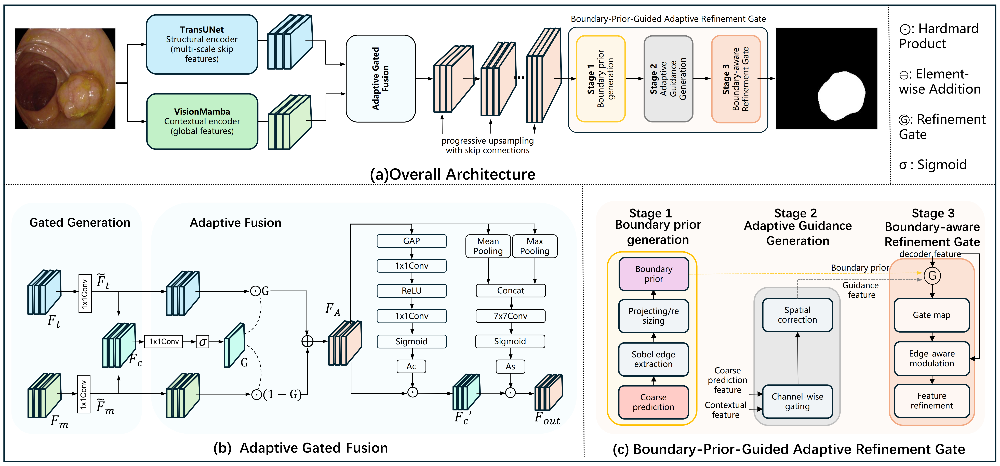

 # A Dual-Branch Boundary-Aware Feedback Network for Medical Image Segmentation

**Our code will be published after the paper is received.**

This is the PyTorch implementation for **DBF-Net** proposed in the paper **A Dual-Branch Boundary-Aware Feedback Network for Medical Image Segmentation**.

> Junyang Song, Changjun Zhou, Gang-Feng Ma*, Xizhi Tian.





## 2. Running environment

We develop our codes in the following environment:

- python==3.10.19
- numpy==2.2.6
- torch==2.3.0
- torch-cuda=11.8

## 4. How to run the codes

```python
python -m fusion.train
```
